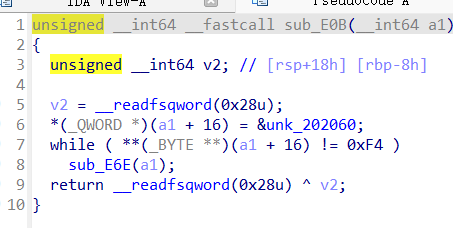

# GWCTF2019-re-babyvm


## 1. 先大致浏览一下

DIE查一下有没有壳


ida64看一下函数


对vm有了解的话，可以看出这里代码的前四行相当于设置了寄存器，unk_202060相当于是操作码（指令流），而下面一个数字一个函数的相当于汇编指令。



当`**(a1 + 16) != 0xF4`，执行`sub_E6E`


遍历指令表，直到找到与当前指令操作码匹配的指令表项

执行`(*(16 * (i + 1LL) + a1 + 16))(a1)`这一地址的函数


`sub_F83`函数check flag


## 2. 新建结构体

视图->打开子视图->结构体窗口

右键->添加结构体类型


创建完后，按d添加结构体成员，多点几次d变成dd。再点其他地方然后按d添加结构体成员

按n改名字，最终如下图所示


然后给`_cpu`结构体添加成员，按y改成opcode结构体类型，再按`*`改成指针数组


回到第一个函数将a1类型改成`_cpu *`


第二个函数`sub_E6E`遍历指令表，直到找到与当前指令操作码匹配的指令表项

找到匹配的指令表项后，调用其对应的处理函数


然后依次设置一下`sub_B5F`和`sub_A64`等函数的参数类型为`_cpu *`


## 3. 分析一下函数


`sub_B5F`实现了一个简单的指令解码和执行逻辑，类似于汇编语言中的指令解码器。它根据指令的操作码执行不同的操作，主要涉及寄存器和内存的读写操作，功能类似于`mov`。


`sub_A64`实现了`xor`功能


`sub_AC5`验证了字符串长度


`sub_956`实现了`nop`指令


`sub_A08`实现了`mul`指令


`sub_8F0`实现了`xchg`


`sub_99C`实现了`eax=ecx+2*ebx+3*eax`


## 4. 导出指令流


```python
unk_202060 = [0xF5, 0xF1, 0xE1, 0x00, 0x00, 0x00, 0x00, 0xF2, 0xF1, 0xE4, 0x20, 0x00, 0x00, 0x00, 0xF1, 0xE1, 0x01, 0x00, 0x00, 0x00, 0xF2, 0xF1, 0xE4, 0x21, 0x00, 0x00, 0x00, 0xF1, 0xE1, 0x02, 0x00, 0x00, 0x00, 0xF2, 0xF1, 0xE4, 0x22, 0x00, 0x00, 0x00, 0xF1, 0xE1, 0x03, 0x00, 0x00, 0x00, 0xF2, 0xF1, 0xE4, 0x23, 0x00, 0x00, 0x00, 0xF1, 0xE1, 0x04, 0x00, 0x00, 0x00, 0xF2, 0xF1, 0xE4, 0x24, 0x00, 0x00, 0x00, 0xF1, 0xE1, 0x05, 0x00, 0x00, 0x00, 0xF2, 0xF1, 0xE4, 0x25, 0x00, 0x00, 0x00, 0xF1, 0xE1, 0x06, 0x00, 0x00, 0x00, 0xF2, 0xF1, 0xE4, 0x26, 0x00, 0x00, 0x00, 0xF1, 0xE1, 0x07, 0x00, 0x00, 0x00, 0xF2, 0xF1, 0xE4, 0x27, 0x00, 0x00, 0x00, 0xF1, 0xE1, 0x08, 0x00, 0x00, 0x00, 0xF2, 0xF1, 0xE4, 0x28, 0x00, 0x00, 0x00, 0xF1, 0xE1, 0x09, 0x00, 0x00, 0x00, 0xF2, 0xF1, 0xE4, 0x29, 0x00, 0x00, 0x00, 0xF1, 0xE1, 0x0A, 0x00, 0x00, 0x00, 0xF2, 0xF1, 0xE4, 0x2A, 0x00, 0x00, 0x00, 0xF1, 0xE1, 0x0B, 0x00, 0x00, 0x00, 0xF2, 0xF1, 0xE4, 0x2B, 0x00, 0x00, 0x00, 0xF1, 0xE1, 0x0C, 0x00, 0x00, 0x00, 0xF2, 0xF1, 0xE4, 0x2C, 0x00, 0x00, 0x00, 0xF1, 0xE1, 0x0D, 0x00, 0x00, 0x00, 0xF2, 0xF1, 0xE4, 0x2D, 0x00, 0x00, 0x00, 0xF1, 0xE1, 0x0E, 0x00, 0x00, 0x00, 0xF2, 0xF1, 0xE4, 0x2E, 0x00, 0x00, 0x00, 0xF1, 0xE1, 0x0F, 0x00, 0x00, 0x00, 0xF2, 0xF1, 0xE4, 0x2F, 0x00, 0x00, 0x00, 0xF1, 0xE1, 0x10, 0x00, 0x00, 0x00, 0xF2, 0xF1, 0xE4, 0x30, 0x00, 0x00, 0x00, 0xF1, 0xE1, 0x11, 0x00, 0x00, 0x00, 0xF2, 0xF1, 0xE4, 0x31, 0x00, 0x00, 0x00, 0xF1, 0xE1, 0x12, 0x00, 0x00, 0x00, 0xF2, 0xF1, 0xE4, 0x32, 0x00, 0x00, 0x00, 0xF1, 0xE1, 0x13, 0x00, 0x00, 0x00, 0xF2, 0xF1, 0xE4, 0x33, 0x00, 0x00, 0x00, 0xF4, 0x00, 0x00, 0x00, 0x00, 0x00, 0x00, 0x00, 0x00, 0x00, 0x00, 0x00, 0x00, 0x00, 0x00, 0x00, 0x00, 0x00, 0x00, 0x00, 0x00, 0x00, 0x00, 0x00, 0x00, 0x00, 0x00, 0xF5, 0xF1, 0xE1, 0x00, 0x00, 0x00, 0x00, 0xF1, 0xE2, 0x01, 0x00, 0x00, 0x00, 0xF2, 0xF1, 0xE4, 0x00, 0x00, 0x00, 0x00, 0xF1, 0xE1, 0x01, 0x00, 0x00, 0x00, 0xF1, 0xE2, 0x02, 0x00, 0x00, 0x00, 0xF2, 0xF1, 0xE4, 0x01, 0x00, 0x00, 0x00, 0xF1, 0xE1, 0x02, 0x00, 0x00, 0x00, 0xF1, 0xE2, 0x03, 0x00, 0x00, 0x00, 0xF2, 0xF1, 0xE4, 0x02, 0x00, 0x00, 0x00, 0xF1, 0xE1, 0x03, 0x00, 0x00, 0x00, 0xF1, 0xE2, 0x04, 0x00, 0x00, 0x00, 0xF2, 0xF1, 0xE4, 0x03, 0x00, 0x00, 0x00, 0xF1, 0xE1, 0x04, 0x00, 0x00, 0x00, 0xF1, 0xE2, 0x05, 0x00, 0x00, 0x00, 0xF2, 0xF1, 0xE4, 0x04, 0x00, 0x00, 0x00, 0xF1, 0xE1, 0x05, 0x00, 0x00, 0x00, 0xF1, 0xE2, 0x06, 0x00, 0x00, 0x00, 0xF2, 0xF1, 0xE4, 0x05, 0x00, 0x00, 0x00, 0xF1, 0xE1, 0x06, 0x00, 0x00, 0x00, 0xF1, 0xE2, 0x07, 0x00, 0x00, 0x00, 0xF1, 0xE3, 0x08, 0x00, 0x00, 0x00, 0xF1, 0xE5, 0x0C, 0x00, 0x00, 0x00, 0xF6, 0xF7, 0xF1, 0xE4, 0x06, 0x00, 0x00, 0x00, 0xF1, 0xE1, 0x07, 0x00, 0x00, 0x00, 0xF1, 0xE2, 0x08, 0x00, 0x00, 0x00, 0xF1, 0xE3, 0x09, 0x00, 0x00, 0x00, 0xF1, 0xE5, 0x0C, 0x00, 0x00, 0x00, 0xF6, 0xF7, 0xF1, 0xE4, 0x07, 0x00, 0x00, 0x00, 0xF1, 0xE1, 0x08, 0x00, 0x00, 0x00, 0xF1, 0xE2, 0x09, 0x00, 0x00, 0x00, 0xF1, 0xE3, 0x0A, 0x00, 0x00, 0x00, 0xF1, 0xE5, 0x0C, 0x00, 0x00, 0x00, 0xF6, 0xF7, 0xF1, 0xE4, 0x08, 0x00, 0x00, 0x00, 0xF1, 0xE1, 0x0D, 0x00, 0x00, 0x00, 0xF1, 0xE2, 0x13, 0x00, 0x00, 0x00, 0xF8, 0xF1, 0xE4, 0x0D, 0x00, 0x00, 0x00, 0xF1, 0xE7, 0x13, 0x00, 0x00, 0x00, 0xF1, 0xE1, 0x0E, 0x00, 0x00, 0x00, 0xF1, 0xE2, 0x12, 0x00, 0x00, 0x00, 0xF8, 0xF1, 0xE4, 0x0E, 0x00, 0x00, 0x00, 0xF1, 0xE7, 0x12, 0x00, 0x00, 0x00, 0xF1, 0xE1, 0x0F, 0x00, 0x00, 0x00, 0xF1, 0xE2, 0x11, 0x00, 0x00, 0x00, 0xF8, 0xF1, 0xE4, 0x0F, 0x00, 0x00, 0x00, 0xF1, 0xE7, 0x11, 0x00, 0x00, 0x00,0xF4,-1,-1,-1,-1,-1,-1,-1,-1,-1,-1,-1]
#添加-1以便边界识别
epi = 0


while (1):
    if unk_202060[epi]==0xF1:
        if unk_202060[epi + 1] == 0xE1:
            print(f"mov eax, flag[{unk_202060[epi+2]}]")
        elif unk_202060[epi + 1] == 0xE2:
            print(f"mov ebx, flag[{unk_202060[epi+2]}]")
        elif unk_202060[epi + 1] == 0xE3:
            print(f"mov ecx, flag[{unk_202060[epi+2]}]")
        elif unk_202060[epi + 1] == 0xE4:
            print(f"mov flag[{unk_202060[epi+2]}],eax")
        elif unk_202060[epi + 1] == 0xE5:
            print(f"mov edx, flag[{unk_202060[epi+2]}]")
        elif unk_202060[epi + 1] == 0xE7:
            print(f"mov flag[{unk_202060[epi+2]}],ebx")
        else:
            print("mov指令有问题")
        epi+=6 # 该指令长度为6
    elif unk_202060[epi] == 0xF2:
        print("xor eax,ebx")
        epi += 1
    elif unk_202060[epi] == 0xF5:
        print("check_length()")
        epi += 1
    elif unk_202060[epi] == 0xF4:
        print("nop")
        epi += 1
    elif unk_202060[epi] == 0xF7:
        print("mul eax,edx")
        epi+=1
    elif unk_202060[epi] == 0xF8:
        print("xchg eax,ebx")
        epi += 1
    elif unk_202060[epi] == 0xF6:
        print("eax=ecx+2*ebx+3*eax")
        epi+=1
    elif unk_202060[epi] == -1:
        print("分析结束")
        break
    else:
        print(f"操作码无法识别: {unk_202060[epi]}")
        epi+=1
```


分析导出的指令流易知：前半段将flag字符串依次与ebx做异或再放到后面

后半段是对flag字符串进行变换

```assembly
check_length()
mov eax, flag[0]
xor eax,ebx
mov flag[32],eax
mov eax, flag[1]
xor eax,ebx
mov flag[33],eax
mov eax, flag[2]
xor eax,ebx
mov flag[34],eax
mov eax, flag[3]
xor eax,ebx
mov flag[35],eax
mov eax, flag[4]
xor eax,ebx
mov flag[36],eax
mov eax, flag[5]
xor eax,ebx
mov flag[37],eax
mov eax, flag[6]
xor eax,ebx
mov flag[38],eax
mov eax, flag[7]
xor eax,ebx
mov flag[39],eax
mov eax, flag[8]
xor eax,ebx
mov flag[40],eax
mov eax, flag[9]
xor eax,ebx
mov flag[41],eax
mov eax, flag[10]
xor eax,ebx
mov flag[42],eax
mov eax, flag[11]
xor eax,ebx
mov flag[43],eax
mov eax, flag[12]
xor eax,ebx
mov flag[44],eax
mov eax, flag[13]
xor eax,ebx
mov flag[45],eax
mov eax, flag[14]
xor eax,ebx
mov flag[46],eax
mov eax, flag[15]
xor eax,ebx
mov flag[47],eax
mov eax, flag[16]
xor eax,ebx
mov flag[48],eax
mov eax, flag[17]
xor eax,ebx
mov flag[49],eax
mov eax, flag[18]
xor eax,ebx
mov flag[50],eax
mov eax, flag[19]
xor eax,ebx
mov flag[51],eax
nop
操作码无法识别: 0
...
check_length()
mov eax, flag[0]
mov ebx, flag[1]
xor eax,ebx
mov flag[0],eax
mov eax, flag[1]
mov ebx, flag[2]
xor eax,ebx
mov flag[1],eax
mov eax, flag[2]
mov ebx, flag[3]
xor eax,ebx
mov flag[2],eax
mov eax, flag[3]
mov ebx, flag[4]
xor eax,ebx
mov flag[3],eax
mov eax, flag[4]
mov ebx, flag[5]
xor eax,ebx
mov flag[4],eax
mov eax, flag[5]
mov ebx, flag[6]
xor eax,ebx
mov flag[5],eax
mov eax, flag[6]
mov ebx, flag[7]
mov ecx, flag[8]
mov edx, flag[12]
eax=ecx+2*ebx+3*eax
mul eax,edx
mov flag[6],eax
mov eax, flag[7]
mov ebx, flag[8]
mov ecx, flag[9]
mov edx, flag[12]
eax=ecx+2*ebx+3*eax
mul eax,edx
mov flag[7],eax
mov eax, flag[8]
mov ebx, flag[9]
mov ecx, flag[10]
mov edx, flag[12]
eax=ecx+2*ebx+3*eax
mul eax,edx
mov flag[8],eax
mov eax, flag[13]
mov ebx, flag[19]
xchg eax,ebx
mov flag[13],eax
mov flag[19],ebx
mov eax, flag[14]
mov ebx, flag[18]
xchg eax,ebx
mov flag[14],eax
mov flag[18],ebx
mov eax, flag[15]
mov ebx, flag[17]
xchg eax,ebx
mov flag[15],eax
mov flag[17],ebx
nop
分析结束
```


## 5. 写代码逆一下正确输入


实际上`check_flag()`函数是`sub_F00`而不是`sub_F83`，分析可知上面指令流的前半段没有意义


```python
from z3 import *
s=Solver()
byte_202020=[0x69, 0x45, 0x2A, 0x37, 0x09, 0x17, 0xC5, 0x0B, 0x5C, 0x72, 0x33, 0x76, 0x33, 0x21, 0x74, 0x31, 0x5F, 0x33, 0x73, 0x72, 0x00, 0x00, 0x00, 0x00, 0x00, 0x00, 0x00, 0x00, 0x00, 0x00, 0x00, 0x00]

flag=[]
flags=[BitVec('%d'%i,8)for i in range(20)] #char类型
v=[0]*20 #不设v来存中间过程会报错
for i in range(0,6):
    v[i]=flags[i]^flags[i+1]
for i in range(6,9):
    v[i]=(flags[i]*3+flags[i+1]*2+flags[i+2])*flags[12]
for i in range(9, 20):
    v[i]=flags[i]
for i in range(13,16,1):
    tmp=v[i]
    v[i]=v[19-i+13]
    v[19-i+13]=tmp
for i in range(20):
    s.add(v[i] ==byte_202020[i])

if s.check()==sat:
    r=s.model()
    for i in flags:
        flag.append(r[i].as_long())
    print("".join(chr(x) for x in flag))
else:
    print("无解")
#Y0u_hav3_r3v3rs3_1t!
```

