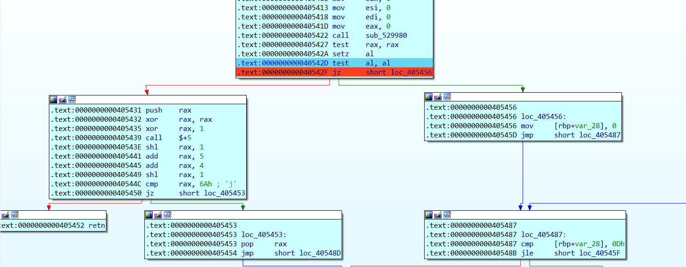

CCSSSC-2025

## donntyousee


### 跟踪一波

程序参杂着很多花指令，所以直接看汇编


可以直接搜字符串


跳过去然后交叉引用到下图


对`_ZTI3rc4`进行交叉引用，来到下图，然后跟踪一下四个函数就行


或者从start函数开始跟踪（很阴间）

跟踪发现rc4


看一下`ZTV7rc4_lld`处有什么吧，后面应当有计算偏移调用rc4相关的函数


第三次调用红圈函数时打印`plz input your flag`

准确来说时04054df处的sub_4e4060打印plz input your flag 


nop掉retn花指令


跟踪r8


nop掉retn花指令


反编译，这是rc4中的密钥调度算法


继续跟踪

unk_5C6CC0是我们的输入


f7进入r8指向的函数，nop掉retn花指令


反编译，改下a2和a3类型

魔改的RC4，多了一步异或

a3指向我们的输入


后面不太好跟踪，还是看一下前面提到的sub_405CAA吧

nop掉retn花指令


反编译


密文调整一下格式

```python
from ctypes import *
v7=[]
v7.append(0xD3581C51AF54CD25)
v7.append( 0xD45D83EC564F4BA8)
v7.append( 0xA5B073E06F4A47F6)
v7.append(0xF6F42B5E8117C3A8)
v7.append( 0x579963A8FF2FEA71)
l=[]
for i in v7:
    i = c_ulonglong(i)
    for j in range(8):

        k = c_ubyte(0xFF and i.value)
        #print(hex(k.value).replace("0x",""),end="")
        l.append(k.value)
        i.value = i.value >> 8
print("[",end="")
for i in l:
    print("0x{:02x}, ".format(i),end="")
print("]",end="")
#[0x25, 0xcd, 0x54, 0xaf, 0x51, 0x1c, 0x58, 0xd3, 0xa8, 0x4b, 0x4f, 0x56, 0xec, 0x83, 0x5d, 0xd4, 0xf6, 0x47, 0x4a, 0x6f, 0xe0, 0x73, 0xb0, 0xa5, 0xa8, 0xc3, 0x17, 0x81, 0x5e, 0x2b, 0xf4, 0xf6, 0x71, 0xea, 0x2f, 0xff, 0xa8, 0x63, 0x99, 0x57 ]
#25cd54af511c58d3a84b4f56ec835dd4f6474a6fe073b0a5a8c317815e2bf4f671ea2fffa8639957
```


输入

```
aaaaaaaaaaaaaaaaaaaaaaaaaaaaaaaaaaaaaaaaaaaaaaaaaa
```

然后


```c
#include <stdio.h>
#include <stdlib.h>
#include <stdint.h>
#include <string.h>


void  sub_405848( unsigned char *a2, uint8_t *a3, uint64_t a4)
{
  uint64_t result; // rax
  char v5; // [rsp+27h] [rbp-119h]
  unsigned int i; // [rsp+28h] [rbp-118h]
  unsigned int j; // [rsp+28h] [rbp-118h]
  int v8=0; // [rsp+2Ch] [rbp-114h]
  int64_t v9[33]; // [rsp+30h] [rbp-110h] BYREF
  uint64_t v10; // [rsp+138h] [rbp-8h]

  memset(v9, 0, 256);
for ( i = 0; i <= 0xFF; ++i )
  {
    a2[i] = i;
    *((uint8_t *)v9 + i) = a3[i % a4];
  }
  for ( j = 0; j <= 0xFF; ++j )
  {
    v8 = (uint8_t)(v8 + a2[j] + *((uint8_t *)v9 + j));
    v5 = a2[j];
    a2[j] = a2[v8];
    a2[v8] = v5;
  }
  
}


void sub_405EAA(uint8_t *a2, uint8_t *a3, uint64_t a4)
{
  uint64_t result; // rax
  char v5; // [rsp+2Bh] [rbp-15h]
  int v6=0; // [rsp+2Ch] [rbp-14h]
  int v7=0; // [rsp+30h] [rbp-10h]
  uint64_t i; // [rsp+38h] [rbp-8h]
  for ( i = 0LL; ; ++i )
  {
    result = i;
    if ( i >= a4 )
      break;
    v6 = (uint8_t)(v6 + 1);
    v7 = (uint8_t)(a2[v6] + v7);
    v5 = a2[v6];
    a2[v6] = a2[v7];
    a2[v7] = v5;
    a3[i] ^= a2[(uint8_t)(a2[v6] + a2[v7])] ^ 0x23;
  }

}
unsigned char unk_5C5110[15] = {
    0xD7, 0x59, 0x6E, 0x5A, 0xFF, 0xBE, 0xE7, 0xBA, 0x42, 0x2C, 0x38, 0x32, 0x5D, 0xC9, 0x00
};//key
unsigned char Sbox[257]={0};
int main(){
    int64_t v7[5];
	v7[0] = 0xD3581C51AF54CD25LL;
	v7[1] = 0xD45D83EC564F4BA8LL;
	v7[2] = 0xA5B073E06F4A47F6LL;
	v7[3] = 0xF6F42B5E8117C3A8LL;
	v7[4] = 0x579963A8FF2FEA71LL;
    sub_405848( Sbox, unk_5C5110, 0x0E);
    sub_405EAA( Sbox, (uint8_t*)v7, sizeof(v7));
    int i;
    for(i=0;i<sizeof(v7);i++){
        printf("%c",*((uint8_t*)v7 + i));
    }
    return 0;
}
```


### ptrace反调试处理

按理来说，现在该做出来了，但是前面有反调试，导致我们结果是错的

kali `strace`一下查看系统调用

```
strace -f -F -o ./1.txt ./chall
cat ./1.txt
```


`alt+T`搜索`ptrace`即可找到ptrace反调试位置


```c
__int64 __fastcall sub_529980(__int64 a1, __int64 a2, unsigned __int64 a3, __int64 a4, __int64 a5, __int64 a6, char a7)
{
  __int64 *v7; // r10
  __int64 result; // rax
  unsigned int v9; // r8d
  __int64 v10; // [rsp+8h] [rbp-58h] BYREF
  int v11; // [rsp+10h] [rbp-50h]
  char *v12; // [rsp+18h] [rbp-48h]
  char *v13; // [rsp+20h] [rbp-40h]
  unsigned __int64 v14; // [rsp+28h] [rbp-38h]
  char v15; // [rsp+30h] [rbp-30h] BYREF
  __int64 v16; // [rsp+38h] [rbp-28h]
  unsigned __int64 v17; // [rsp+40h] [rbp-20h]
  __int64 *v18; // [rsp+48h] [rbp-18h]

  v16 = a2;
  v7 = &v10;
  v17 = a3;
  v18 = (__int64 *)a4;
  v14 = __readfsqword(0x28u);
  v11 = 16;
  v12 = &a7;
  if ( (unsigned int)(a1 - 1) >= 3 )
    v7 = v18;
  v13 = &v15;
  result = sys_ptrace(a1, (unsigned int)a2, a3, (unsigned __int64)v7);
  //sys_ptrace(long request, long pid, long addr, long data)
  //尝试PTRACE_TRACEME，成功返回0，
  //失败返回-1(0xffffffffffffffff)
  //但是一个进程仅能被一个进程调试，所以这里ida动调时会返回-1
  if ( (unsigned __int64)result > 0xFFFFFFFFFFFFF000LL )
  {
    __writefsdword(0xFFFFFFC0, -(int)result);
      //fs偏移0xFFFFFFC0处写入-(int)result
    result = -1LL;
  }
  else if ( result >= 0 && v9 <= 2 )
  {
    __writefsdword(0xFFFFFFC0, 0);
    result = v10;
  }
  if ( v14 != __readfsqword(0x28u) )//检测通过fs:40处的stack canary是否修改
    sub_52BE90();
  return result;
}
```




call完反调试函数后，rax全1

`test rax,rax`与操作且仅修改标志寄存器，结果非0，所以zf为0。

`setz al`将ZF标志（零标志位）的值传给AL寄存器。

再`test al,al`与操作仅修改标志寄存器，结果为0，所以zf为1。


这边直接jz改为jnz，然后追踪到`sub_405CAA(__int64 a1, __int64 a2)`，提取一下a2的值当作`input_enc`


```python
input=b"aaaaaaaaaaaaaaaaaaaaaaaaaaaaaaaaaaaaaaaaaaaaaaaaaa"
input_enc=[0x20, 0xCD, 0x47, 0xBA, 0x4B, 0x04, 0x09, 0xE7, 0x8D, 0x1A, 0x40, 0x43, 0xC1, 0xD6, 0x5F, 0xFE, 0xF0, 0x16, 0x44, 0x4A, 0xB2, 0x6B, 0xE2, 0xF0, 0x9D, 0x92, 0x30, 0xD1, 0x51, 0x0E, 0xC1, 0xFF, 0x23, 0xC9, 0x7A, 0xFF, 0x9C, 0x76, 0xA1, 0x4B, 0x36, 0x59, 0x8F, 0xD3, 0xF1, 0xB4, 0x2D, 0x31, 0x6F, 0x78]
enc=[0x25, 0xcd, 0x54, 0xaf, 0x51, 0x1c, 0x58, 0xd3, 0xa8, 0x4b, 0x4f, 0x56, 0xec, 0x83, 0x5d, 0xd4, 0xf6, 0x47, 0x4a, 0x6f, 0xe0, 0x73, 0xb0, 0xa5, 0xa8, 0xc3, 0x17, 0x81, 0x5e, 0x2b, 0xf4, 0xf6, 0x71, 0xea, 0x2f, 0xff, 0xa8, 0x63, 0x99, 0x57 ]

for i in range(len(enc)):
    enc[i] ^= input[i] ^ input_enc[i]
    #plaintext2=ciper2^keystream^ 0x23
	#plaintext2=ciper2^plaintext1^ciper1^0x23^0x23
    #plaintext2=ciper2^plaintext1^ciper1
print(bytes(enc))
#b'dart{y0UD0ntL4cKg0oD3y34T0F1nDTh3B4aUtY}'
```


或者写C语言来解

````c
#include <stdio.h>
#include <stdlib.h>
#include <stdint.h>
#include <string.h>


void  sub_405848(unsigned char* a2, uint8_t* a3, uint64_t a4)
{
    uint64_t result; // rax
    char v5; // [rsp+27h] [rbp-119h]
    unsigned int i; // [rsp+28h] [rbp-118h]
    unsigned int j; // [rsp+28h] [rbp-118h]
    int v8 = 0; // [rsp+2Ch] [rbp-114h]
    int64_t v9[33]; // [rsp+30h] [rbp-110h] BYREF
    uint64_t v10; // [rsp+138h] [rbp-8h]

    memset(v9, 0, 256);
    for (i = 0; i <= 0xFF; ++i)
    {
        a2[i] = i;
        *((uint8_t*)v9 + i) = a3[i % a4];
    }
    for (j = 0; j <= 0xFF; ++j)
    {
        v8 = (uint8_t)(v8 + a2[j] + *((uint8_t*)v9 + j));
        v5 = a2[j];
        a2[j] = a2[v8];
        a2[v8] = v5;
    }

}


void sub_405EAA(uint8_t* a2, uint8_t* a3, uint64_t a4)
{
    uint64_t result; // rax
    char v5; // [rsp+2Bh] [rbp-15h]
    int v6 = 0; // [rsp+2Ch] [rbp-14h]
    int v7 = 0; // [rsp+30h] [rbp-10h]
    uint64_t i; // [rsp+38h] [rbp-8h]
    for (i = 0LL; ; ++i)
    {
        result = i;
        if (i >= a4)
            break;
        v6 = (uint8_t)(v6 + 1);
        v7 = (uint8_t)(a2[v6] + v7);
        v5 = a2[v6];
        a2[v6] = a2[v7];
        a2[v7] = v5;
        a3[i] ^= a2[(uint8_t)(a2[v6] + a2[v7])] ^ 0x23;
    }

}
unsigned char unk_5C5110[15] = {
    0x92, 0x1C, 0x2B, 0x1F, 0xBA, 0xFB, 0xA2, 0xFF, 0x07, 0x69, 0x7D, 0x77, 0x18, 0x8C, 0x00
};//key
unsigned char Sbox[257] = { 0 };
int main() {
    int64_t v7[5];
    int i;
    v7[0] = 0xD3581C51AF54CD25LL;
    v7[1] = 0xD45D83EC564F4BA8LL;
    v7[2] = 0xA5B073E06F4A47F6LL;
    v7[3] = 0xF6F42B5E8117C3A8LL;
    v7[4] = 0x579963A8FF2FEA71LL;
    sub_405848(Sbox, unk_5C5110, 0x0E);
    printf("Sbox: \n");
    for (i = 0;i < sizeof(Sbox);i++) {
        printf("%02x ", *(uint8_t*)(Sbox + i));
    }
    printf("\nciper2: \n");
    for (i = 0;i < sizeof(v7);i++) {
        printf("%02x ", *((uint8_t*)v7+i));
    }
    sub_405EAA(Sbox, (uint8_t*)v7, sizeof(v7));
    
    printf("\nflag: \n");
    for (i = 0;i < sizeof(v7);i++) {
        printf("%c", *((uint8_t*)v7 + i));
    }
    return 0;
}
````


## 参考

[REVERSE-COMPETITION-CCSSSC-2025 P1umH0](https://blog.csdn.net/weixin_45582916/article/details/144962552)


